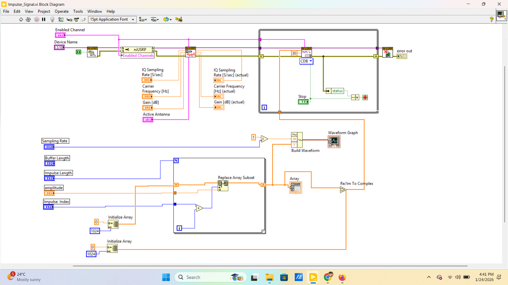

# 📡 Single-Carrier Channel Impulse Response Estimation using NI USRP-2901

## 📖 Overview

This project implements real-time wireless channel sounding using the **NI USRP-2901** Software Defined Radio (SDR).
A band-limited impulse signal is transmitted at **915 MHz**, and the received complex baseband IQ samples are processed to estimate the **Channel Impulse Response (CIR)**.

The wireless channel is modeled as a Linear Time-Invariant (LTI) system:

[
y[n] = x[n] * h[n]
]

Since the transmitted signal is an impulse, the received signal directly represents the effective channel impulse response.

---

## 🎯 Objectives

* Transmit a discrete-time band-limited impulse using NI USRP-2901
* Capture complex baseband IQ samples at the receiver
* Estimate channel impulse response in time domain
* Measure channel gains and propagation delay
* Analyze multipath effects

---

## 🛠 System Configuration

| Parameter           | Value            |
| ------------------- | ---------------- |
| Carrier Frequency   | 915 MHz          |
| Sampling Rate       | 1 MS/s           |
| Buffer Length       | 1024 samples     |
| Impulse Length      | 5 samples        |
| Effective Bandwidth | ~200 kHz         |
| SDR Platform        | NI USRP-2901     |
| Tools Used          | LabVIEW + MATLAB |

---

## ⚙️ Transmitter Design

* Generated a discrete-time impulse centered at a specified index
* Converted real-valued impulse to complex baseband IQ signal
* Transmitted continuously using NI-USRP Tx blocks in LabVIEW

Impulse duration:

[
T_{pulse} = \frac{5}{10^6} = 5 \text{ microseconds}
]

Effective bandwidth:

[
B \approx \frac{1}{T_{pulse}} \approx 200 \text{ kHz}
]

---

## 📡 Receiver Design

* Captured complex IQ samples using NI-USRP Rx blocks
* Extracted real part (or magnitude) of received samples
* Plotted received waveform in time domain
* Stored received data for MATLAB processing

The received waveform represents:

[
h[n] = \text{Channel Impulse Response}
]

---

## 📊 MATLAB Post-Processing

```matlab
clc;
clear;
close all;

%% ===============================
% 1. Read Channel Gain Samples
% ================================

filePath = 'D:\Resume_Project\Channel_Gain_Estimation_Using_Single_Carrier\Matlab_Code\Channel_Gain_500_Samples.xlsx';
gains = readmatrix(filePath);

N = length(gains);

disp(['Number of samples loaded: ', num2str(N)]);

%% ===============================
% 2. Plot Channel Gain vs Index
% ================================

figure;
plot(gains,'LineWidth',1.2);
xlabel('Sample Index');
ylabel('Channel Gain (Linear Scale)');
title('Channel Gain Variation (Indoor LOS)');
grid on;

%% ===============================
% 3. Plot Histogram (PDF Normalized)
% ================================

figure;
histogram(gains,30,'Normalization','pdf');
xlabel('Channel Gain');
ylabel('Probability Density');
title('Histogram of Channel Gains');
grid on;
hold on;

%% ===============================
% 4. Estimate Rician Parameters
% ================================

mu = mean(gains);
variance = var(gains);

disp(['Mean Gain: ', num2str(mu)]);
disp(['Variance: ', num2str(variance)]);

K_est = (mu^2 - variance) / (2*variance);
K_dB_est = 10*log10(abs(K_est));

disp(['Estimated K-factor (dB): ', num2str(K_dB_est)]);

%% ===============================
% 5. Generate Theoretical Rician PDF
% ================================

Omega = mu^2 + variance;
K = abs(K_est);

s = sqrt((K/(K+1))*Omega);
sigma = sqrt(Omega/(2*(K+1)));

x = linspace(min(gains), max(gains), 1000);

rician_pdf = (x./sigma.^2) .* ...
    exp(-(x.^2 + s^2)/(2*sigma^2)) .* ...
    besseli(0, x*s/(sigma^2));

plot(x, rician_pdf,'r','LineWidth',2);
legend('Measured Histogram','Estimated Rician PDF');

grid on;

%% ===============================
% 6. Plot in dB scale (Optional)
% ================================

gains_dB = 20*log10(gains);

figure;
histogram(gains_dB,30,'Normalization','pdf');
xlabel('Channel Gain (dB)');
ylabel('Probability Density');
title('Channel Gain Distribution in dB');
grid on;

disp('Analysis Complete.');
```
## 📊 NI_LabView Design
   ### 📌 Transmitter Design for NI-Labview for NI USRP 2901


## 📊 Channel Statistics Outputs after Simulation
.png)


## 📊 Experimental Outputs

The following figures show real-time over-the-air channel estimation using NI USRP-2901.

### 📌 Channel Gain Distribution
.png)

### 📌 Histogram of Channel Gains
.png)

### 📌 Channel Gain Distribution
.png)


### 📌 Channel Gain Variation
.png)

### 📌 Histogram of Channel Gains
.png)

### 📌 Channel Gain Distribution
.png)

### 📌 Multipath Component Variation
.png)
## 🚀 Key Highlights

* Real-time over-the-air channel estimation using SDR
* Practical implementation of LTI system modeling
* Extraction of propagation delay and multipath components
* Hands-on experience with NI USRP + LabVIEW + MATLAB

---

## 📌 Applications

* Wireless channel sounding
* SDR-based communication system design
* 5G / 6G research and prototyping
* Multipath and fading analysis

---

## 👨‍💻 Author

**Akash Sonowal**
